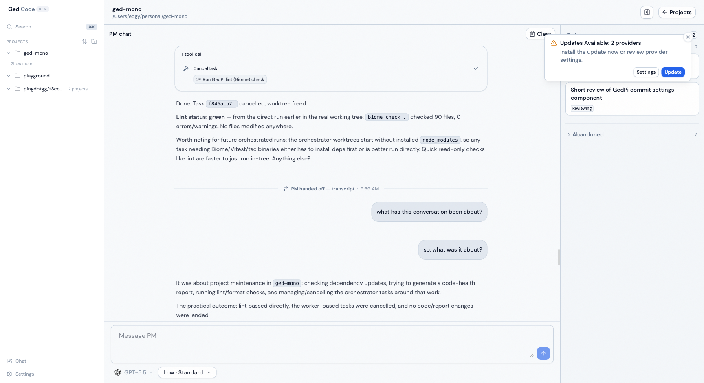

# GedCode

GedCode is a desktop and web workspace for running coding agents. Its centerpiece is the **Orchestrator**: a per-project project-manager (PM) agent that plans work and delegates it to worker agents through a tracked task pipeline — so long-running agentic work stays visible, structured, and recoverable instead of scattered across loose chat threads. It also ships a plain chat surface for direct agent sessions. GedCode supports Codex, Claude, and OpenCode provider sessions.



## Orchestrator

The Orchestrator is the reason GedCode exists. Every participant is an agent, and the human stays in control through conversation and approval gates:

- **The PM** is a per-project agent (running on Claude or Codex — your pick) that you chat with. It plans and delegates but never writes code itself. You can switch its harness mid-project and hand off the conversation to the new one.
- **Workers** are agents the PM spawns to do the actual work. Each runs in its own isolated git worktree with full tool access, and the PM steers and polls them while they run.
- **Tasks** move through a fixed pipeline — `classify → plan → review → work → verify` — surfaced on a task board organized by what needs your attention. `plan` and `land` are human approval gates.

The result: you describe what you want, the PM breaks it into tasks and drives workers through the pipeline, and you approve the moments that matter. The same clarify → plan → implement → verify → commit discipline that GedCode has always been about, now run by an agent you supervise.

## Installation

> [!WARNING]
> GedCode currently supports Codex, Claude, and OpenCode.
> Install and authenticate at least one provider before use:
>
> - Codex: install [Codex CLI](https://developers.openai.com/codex/cli), run `codex login`, and see [docs/providers/codex.md](./docs/providers/codex.md).
> - Claude: install [Claude Code](https://claude.com/product/claude-code), run `claude auth login`, and see [docs/providers/claude.md](./docs/providers/claude.md).
> - OpenCode: install [OpenCode](https://opencode.ai), run `opencode auth login`, and see [docs/providers/opencode.md](./docs/providers/opencode.md).

### Desktop app

Install the latest desktop app from [GitHub Releases](https://github.com/edgyarmati/gedcode/releases). After installing a release build, GedCode can notify you about future updates and let you download/install them from the in-app update button.

## Project status

GedCode is early and moving quickly. Expect bugs, but the direction is clear: make structured agentic coding work visible, repeatable, and recoverable across long-running sessions.

Useful docs:

- Source control integrations: [docs/source-control-providers.md](./docs/source-control-providers.md)
- Observability guide: [docs/observability.md](./docs/observability.md)
- Release checklist: [docs/release.md](./docs/release.md)

## Local development

Before local development, prepare the environment and install dependencies:

```bash
# Optional: only needed if you use mise for dev tool management.
mise install
bun install .
```

Read [CONTRIBUTING.md](./CONTRIBUTING.md) before opening an issue or PR.
